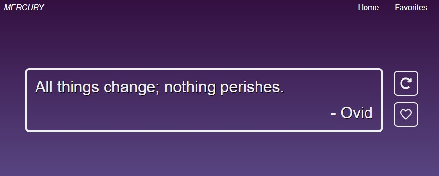

# Employee Directory

## Description

An app that gets random quotes from a 3rd party API and a few buttons to manipulate that data.

## Table of Contents
  
  * [Useage](#useage)
  * [Technologies](#technologies)
  * [License](#license)
  * [Contact](#contact)
  * [Links](#links)

## Useage
The easy way: click on the deployed link in the Links section of this document, you will go to the website that looks like this:

Click on the arrow to get a new quote, and the heart to favorite that quote.

Click on the Favorites link at the top and you will go to the Favorites page that looks like the image below.  The favorited quotes are retrieved from the database and displayed most recent at the top to the first saved quote at the bottom.

## Technologies

JavaScript, React, HTML, CSS, MongoDB, Heroku, MVC model 

## License

Licensed under the [MIT](https://choosealicense.com/licenses/mit/) license 

## Contact

Email: timmartin13@gmail.com

Github: [TimMartin13](https://github.com/TimMartin13)

## Links

Deployed link: https://arcane-citadel-39525.herokuapp.com/

Repository link: https://github.com/TimMartin13/random-quotes

